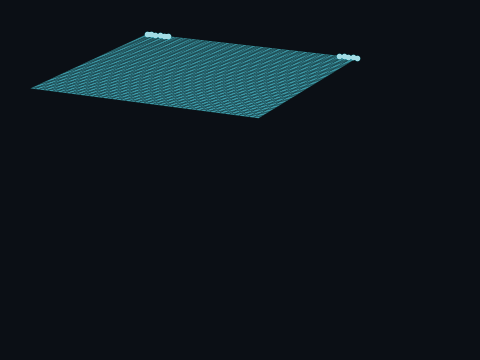

# pbd

A small cloth simulation written in C++ using position-based dynamics (the XPBD variant). It simulates a 50 × 50 grid of particles joined by distance constraints, pinned along one edge, and streams every frame's vertex positions to stdout as raw binary so an external program can visualize them.



## How it works

Each time step (`main.cpp`) does the following:

1. **Predict:** A Störmer–Verlet step with damping moves every particle to a predicted position:
   `x_pred = x + damping * (x - x_prev) + a * dt²`
2. **Solve constraints:** The XPBD Lagrange multipliers are reset to zero, then `CSOLVER_ITERATIONS` Gauss–Seidel passes run over every distance constraint. Each constraint has a compliance of `α = 1 / (stiffness * dt²)` and its own accumulated multiplier (`gaussSeidelX` in `update/GaussSeidel.h`).
3. **Commit:** The predicted positions become the current positions, and the old current positions become the previous ones.
4. **Emit:** All vertex positions are written to stdout as `float32` values.

## Default scene

The scene is hard-coded in `main()`:

| Setting | Value |
| --- | --- |
| Grid | 50 × 50 particles (2,500 total), 0.1 spacing |
| Initial shape | Flat in the XZ plane at y = 0 |
| Pinned particles | On row 0, the particles with `x <= 5` or `x >= 45` (infinite mass) |
| Free particle mass | 0.0002 (stored as inverse mass, 1 / 0.0002 = 5000) |
| Structural constraints | Horizontal and vertical neighbours, stiffness 200 |
| Shear constraints | Diagonals across the grid cells, stiffness 20 |
| Total constraints | 9,653 |
| Time step | 1/60 s (`HZ = 60`) |
| Solver iterations | 15 per step |
| Gravity | (0, -9.8, 0) |
| Damping | 0.995 |
| Steps | 8,192 (about 136.5 s of simulated time) |

## Building

You need a C++ compiler with C++26 support (or at least C++23, see below) and CMake 4.1 or newer, as set in `CMakeLists.txt`.

```sh
cmake -S . -B build -DCMAKE_BUILD_TYPE=Release
cmake --build build
```

A Release build is recommended. Without a build type, CMake adds no optimization flags and the simulation runs much more slowly.

On Windows, `CMakeLists.txt` adds static-linking flags (`-static-libgcc -static-libstdc++ -static`), which assume a MinGW/GCC-style toolchain. `main.cpp` also switches stdout to binary mode there, so the raw frame data is not corrupted by newline translation.

If your CMake is older than 4.1, you can compile the single source file directly. This works with GCC 13:

```sh
g++ -std=c++23 -O2 -o pbd src/main.cpp
```

## Running

```sh
./build/pbd > frames.bin
```

## Configuration

Edit the constants and rebuild:

| What | Where |
| --- | --- |
| Grid size, spacing, pinned particles, particle mass, constraint stiffness, number of steps | `src/main.cpp` |
| Simulation rate (`HZ`) and time step (`DT`) | `src/world/WorldDescription.h` |
| Solver iterations, gravity, damping | `src/update/PhysDescription.h` |

## Project layout

```
.
├── CMakeLists.txt
├── assets
│   └── demo.gif                  # preview shown at the top of this README
├── src
│   ├── main.cpp                  # scene setup, main loop, stdout output
│   ├── Types.h                   # float3 vector type and helpers
│   ├── mesh
│   │   └── MeshData.h            # structure-of-arrays storage for vertices and constraints
│   ├── constraints
│   │   └── ConstraintEditor.h    # addConstraint(): adds a distance constraint at its rest length
│   ├── update
│   │   ├── Stormer.h             # Störmer–Verlet prediction and position commit
│   │   ├── GaussSeidel.h         # distance-constraint solvers
│   │   └── PhysDescription.h     # solver iterations, gravity, damping
│   └── world
│       └── WorldDescription.h    # time step

```

## Notes and limitations

- Particle "mass" values in the code are inverse masses, so `0` marks a pinned particle.
- Only distance constraints are implemented
- `gaussSeidel` (the plain PBD solver) is defined in `GaussSeidel.h` but unused. The simulation uses the XPBD solver, `gaussSeidelX`.
- Constraint rest lengths are measured from the initial grid positions.
